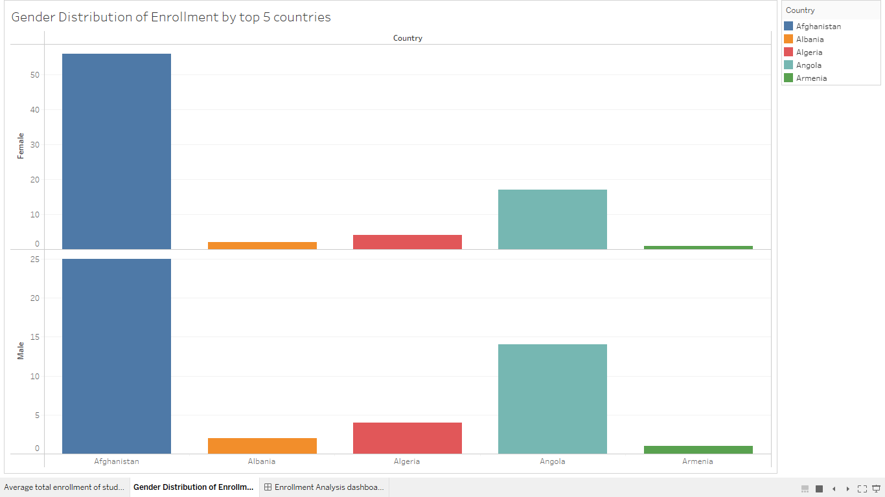
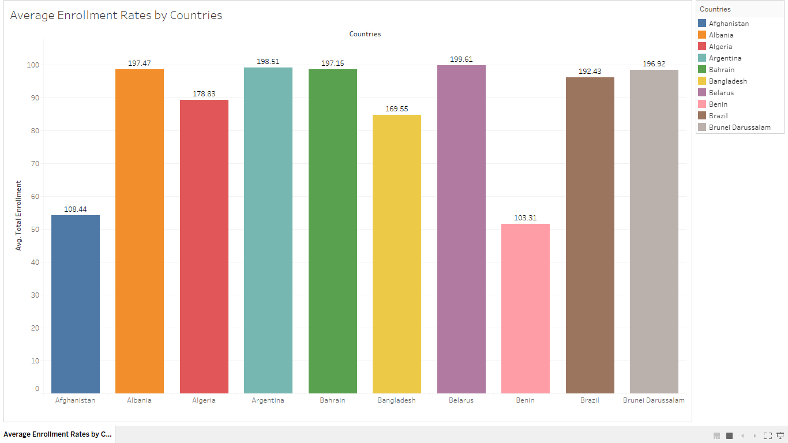
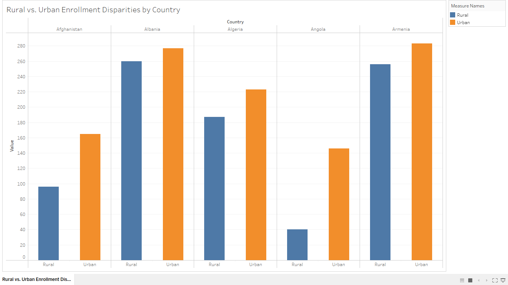
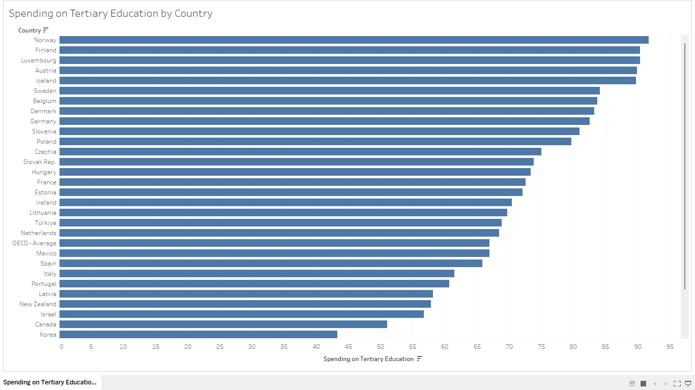

# Education for Sustainable Development (ESD)  

*By: Abhishek Verma*
## A Decision Intelligence Approach to Understanding Sustainable Development Goal (SDG) 4  

# Executive Summary

In order to achieve Sustainable Development Goal 4 (SDG 4), which is to guarantee inclusive and high-quality education for all, this project focuses on examining global trends in education. It investigates learning outcomes, gender equality, and accessibility to education in various geographical areas using global datasets. Finding important issues, patterns, and policy suggestions to enhance educational systems around the world is the aim.

[Read the full background here](Background.md)

## Key performance Indicators (KPIs)

### Education Access Rate (EAR)

<!-- It would be good to place a value proposition to measuring this in this space.  For example: -->
Measuring the Education Access Rate provides a framework for assessing progress, identifying disparities, informing policy, and fostering inclusivity in education, ultimately contributing to sustainable development and social equity.

Summary Details:
* Calculates the proportion of kids with primary and secondary school enrollment.
* Goal: - 95% worldwide enrollment rate

<!-- Repeat for the KPIs below -->
### Gender Parity Index (GPI)

The GPI is a measure used to assess the relative access to education between genders. It is calculated by dividing the number of female students by the number of male students in a specific educational level. A GPI of 1 indicates gender parity, while values below or above 1 highlight disparities. This index is vital for monitoring progress toward gender equality in education (aligned with UN SDG #4), identifying gaps, and informing policies aimed at promoting equal access and opportunities for all genders in educational settings.

Summary Details:
* Compares the rates of education enrollment for men and women.
* Goal: At every level, reach a ratio of 1.0 (equal access).

### Literacy Rate (LR)

* Proportion of the people with basic reading and writing skills.
* The goal is to raise global literacy rates to 90%.

### School Completion Rate (SCR)

* Determines what proportion of students finish each educational level.
* Goal: 85% of secondary school students should finish.

### Education Investment Index (EII)

* Calculates the proportion of GDP allocated to education by the government.
* Goal: Education should account for at least 4% of GDP.

# Analysis:

This bar chart compares the enrollment rates of female and male students in the top 5 countries (Albania, Afganistan, Algeria, Angola, and Armenia). The visualization highlights gender disparities in education access, with some countries showing a higher enrollment rate for females, while others have a more balanced distribution. This analysis helps identify regions where targeted interventions may be needed to improve gender equality in education.

It shows the geographic distribution of the School Enrollment Gender Parity Index (GPI) across different countries. The map indicates color encoding to represent variations in GPI values, where higher values (closer to 1) indicate better gender parity and lower values indicate gender disparities

It shows the average enrollment rates by countries, all nations are defined by different colours and the numbers which are on top of the bars are "Total Enrollment" but on Y axis it shows in average.

It shows the total enrollment of students in schools from rural and urban areas according to top 5 countries. The disparity in Armenia is at the peak in urban area and least one is in Angola in rural.

This horizontal bar chart compares spending on tertiary education across different countries. The countries are listed on the Y-axis, and the percentage of spending is shown on the X-axis. The bars are sorted in descending order, so the countries with the highest spending appear at the top (e.g., Norway, Finland, Luxembourg)

